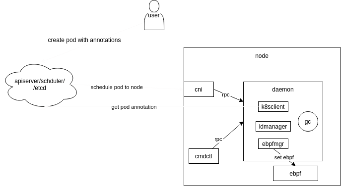

# 注意事项
* 该CNI插件专门为veth peer通信方式（如calico）的pod设计
# 编译部署方法
1. 如果是在本地编译并构建镜像，修改Dockerfile文件使其适配本地环境架构，修改Makefile中的image项使其为单架构构建(没有harbor仓库，无法双架构构建),如果有仓库则忽略
2. make all命令:构建二进制输出到bin目录，制作镜像，并修改install/kubernetes/oncn-bwm.yaml文件
3. 使用镜像和yaml文件部署到K8S环境中，模仿example/example.conflist文件将该cni-plugin插件配置到节点中
4. 创建example/pod.yaml资源测试
# 软件设计


# 配置bpf开发环境
1. 安装libbpf(1.3)：https://github.com/libbpf/libbpf

# 生成bpf代码
```
cd daemon/bpfgo
go generate
```

# 存在的问题
```
使用ebpfgo生成代码，vendor与go generate出现问题
cannot find module providing package github.com/cilium/ebpf/cmd/bpf2go: import lookup disabled by -mod=vendor
        (Go version in go.mod is at least 1.14 and vendor directory exists.)
gen.go:3: running "go": exit status 1
```
先删除vendor目录,
然后做bpf代码生成,
最后go mod vendor
